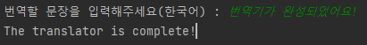
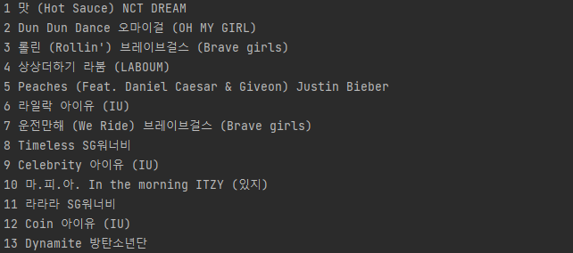
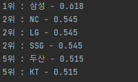
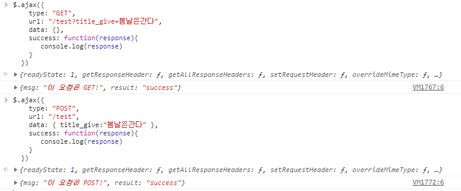
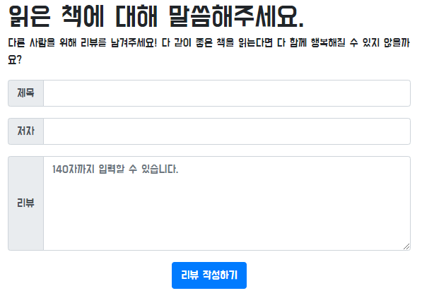
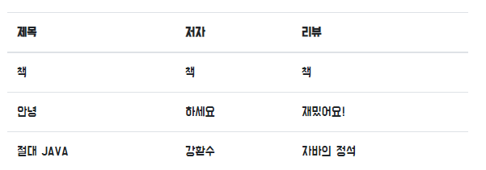
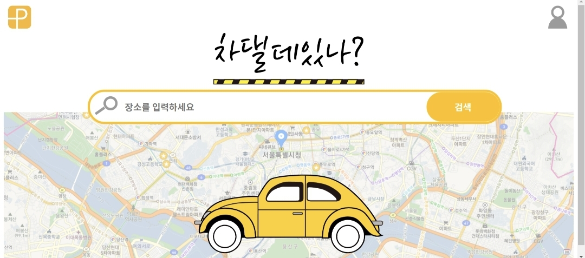

# 🎨 Web_Development 🎨

🖌 2021.04.17 - 2021.06.19<br>
🖌 청년공간 이룸 - SeriesD Developer 과정<br>
🖌 각 Week 카테고리는 수업 및 과제로 구성되어 있으며, 과제는 📒 에서 확인할 수 있다.<br><br>

## 🎟 사용 기술

<details>
  <summary><b>Front-end</b></summary><br>

1. HTML
2. CSS

    - bootstrap

3. JS

    - node.js
    - jest
    - jQuery

</details>

<details>
  <summary><b>Back-end</b></summary><br>

1. python

    - requests
    - beautifulSoup

</details><br>

## 🖼 Week01

<details>
  <summary><b>1.1 HTML & CSS 기초</b></summary><br>
  HTML 기초 태그를 알아보고, 로그인 창을 구현해 보았다.<br><br>

1. 로그인<br>

   > <a href = "https://github.com/bbjoite09/SeriesD/blob/master/practice/week01/login.html">practice/week01/login.html</a>

   h1, h5, input, button 태그를 이용하여 로그인 페이지를 만든다.

   <code>조건. 로그인 안내 내용, ID, PW 입력 칸은 style 태그를 이용하여 가로, 세로 축 기준 중앙으로 배치한다.</code>

   실행 결과는 아래 그림과 같다.

    <p align = center><p>


2. 로그인(CSS 분리)<br>

   > <a href = "https://github.com/bbjoite09/SeriesD/blob/master/practice/week01/login_noCSS.html">practice/week01/login_noCSS.html</a>

   협업을 하는 경우 파일의 분리는 필연적이다.<br>
   style 태그 내부의 내용을 main.css 파일로 옮겨 html/CSS 파일을 분리하였다.

     <p align = center><p>

   추가로, 페이지를 구성하는 글자의 <a src="https://fonts.google.com/?subset=korean"> 폰트</a>도 변경하였다. 해당
   내용은 <a href="https://github.com/bbjoite09/SeriesD/practice/week01/login_noCSS.html">여기</a>에서 확인할 수 있다.<br>

</details>

<details>
  <summary><b>1.2 Bootstrap</b></summary><br>

> <a href = "https://github.com/bbjoite09/SeriesD/blob/master/practice/week01/bootstrap.html">practice/week01/bootstrap.html</a>

부트스트랩을 이용해 클론페이지를 만들어 보았다. 실습 결과는 아래와 같다.
  <p align = center><p><br><br>
</details>
<details>
<summary><b>📒 나만의 one-page 쇼핑몰_01</b></summary><br>
임의의 상품을 판매하는 페이지를 만들어 보았다. 버튼에 대한 반응은 따로 처리하지 않았다.<br>

> <a href ="https://github.com/bbjoite09/SeriesD/blob/master/practice/week01/product.html">practice/week01/product.html</a>

> <a href = "https://github.com/bbjoite09/SeriesD/blob/master/practice/css/style_shop.css">practice/css/style_shop.css</a>

해당 내용은 <a href ="https://github.com/bbjoite09/SeriesD/blob/master/practice/week01/product.html">여기</a>에서 확인할 수 있다.<br>

<p align = center><p>
<br>
</details><br>

## 🖼 Week02

<details>
  <summary><b>2.1 JavaScript & jQuery</b></summary><br>

Week01에서 학습했던 HTML, CSS만으로는 정적인 화면 표현만 가능하였다. 이에 동적 움직임을 줄 수 있도록 하는 언어가 <code>Javascript</code>이다. Javascript는 객체 기반의
프로그래밍 언어이며, ECMAScript의 표준 사양을 가장 잘 구현한 언어로 대부분의 브라우저에서 이를 지원한다.(모든 웹 서버는 HTML, CSS, Javascript를 응답 데이터로 전송함.)<br><br>

1. Javascript 기초 문법<br>

   > <a href = "https://github.com/bbjoite09/SeriesD/blob/master/practice/week02/main.js">practice/week02/main.js</a>

   > <a href = "https://github.com/bbjoite09/SeriesD/blob/master/practice/week02/main.test.js"> practice/week02/main.test.js</a>

   자바스크립트 기초 문법(변수정의, function, 조건문, 반복문 등)을 학습하였다. 추가로 test file을 만들어, 필요한 테스트를 실행해보았다. test 파일을 통해 main 코드에 대한 test를
   진행함으로써 더 견고한 코드를 만들 수 있다.<br>
   +) 일반적으로 test 파일 이름은 <code> 테스트하는 파일.test.js</code> 형식으로 설정한다. 여기서는 main.js를 테스트하므로 main.test.js로 명명하였다.

2. jQuery
   > <a href = "https://github.com/bbjoite09/SeriesD/blob/master/practice/week02/memo.html">practice/week02/memo.html</a>

   <code>jQuery</code>는 javascript 라이브러리로, HTML 속 클라이언트 사이드 스크립트 언어를 단순화하도록 설계되었다. 이는 매우 간단하다는 특징을 가지고 있으며 브라우저 호환성이
   있다.<br>
    ```
    document.getElementById('post-url').value
    >> "Hello"

    $("post-url").val()
    >> "Hello"
    ```

   jQuery를 사용할때는 `<head>`태그 안에 아래 문장을 import 시켜줘야한다.<br>
    ```
    <script src="https://ajax.googleapis.com/ajax/libs/jquery/3.5.1/jquery.min.js"></script>
    ```
    <br>
    week01에서 진행하였던 memo.html에 jQuery를 사용하여 "포스팅박스 열기" 버튼에 대한 반응을 추가했다. 해당 실습에 대한 내용은 <a href = "https://github.com/bbjoite09/SeriesD/blob/master/practice/week02/memo.html">여기</a>에서 확인할 수 있다.<br>

</details>
<details>
  <summary><b>2.2 Ajax & jQuery</b></summary><br>

`Ajax`는 Javascript의 라이브러리 중 하나로 비동기 서버 통신 및 클라이언트와 서버간에 XML 데이터를 주고받는 기술을 말한다. 이때 `비동기`이란 사용자가 보고있는 페이지에 대하여 어떤 동작이
일어났을때, 웹 페이지 전체를 갱신하지 않고 일부분만 업데이트 할 수 있도록하는 것을 말한다. 이는 전체 페이지를 계속해서 갱신하지 않는다는 점에서, 불필요한 낭비를 줄이고 웹페이지의 속도를
향상시킨다.<br><br>
한편 `서버통신`은 서버의 자원을 제공받기 위해 서버-클라이언트 간에 request, response를 하는 것을 말한다.

- Request<br>
  클라이언트는 서버에게 Request 한다. Request의 method로는 DELETE(지우기), GET(가져오기), POST(추가하기) 등이 있다.

- Response<br>
  서버는 클라이언트에게 Response 한다. HTTP 통신 프로토콜에서는 Response status code로 응답의 상태를 표현하는데, 응답은 5가지 그룹으로 나뉜다. 대표적으로 정상 응답(200 OK),
  클라이언트 에러(404 not found), 서버 에러(500 Internal Server Error)가 있다.

<br>

< 실습 >

1. 서울시 OpenAPI(<a href="http://openapi.seoul.go.kr:8088/6d4d776b466c656533356a4b4b5872/json/RealtimeCityAir/1/99">실시간
   미세먼지 상태</a>)를 이용하여 미세먼지 수치(PM10)가 25㎍/㎥ 이상인 관측소(MSRSTE_NM)를 빨강색으로 표시해준다.

   > <a href="https://github.com/bbjoite09/SeriesD/blob/master/practice/week02/ajaxTest.html">practice/week02/ajaxTest.html</a>

2. 일반 API(<a href="https://api.thecatapi.com/v1/images/search">고양이 사진</a> API)를 활용하여 랜덤으로 고양이 이미지를 출력해준다.

   > <a href="https://github.com/bbjoite09/SeriesD/blob/master/practice/week02/randomCat.html">practice/week02/randomCat.html</a>

</details>
<details>
  <summary><b>📒 Javascript and jQuery Practice</b></summary><br>
  1. Javascript

- 버튼을 누를때마다 누른 횟수에 대한 alert창을 띄운다.

  > <a href="https://github.com/bbjoite09/SeriesD/blob/master/practice/week02/homework/buttonCnt.html">practice/week02/homework/buttonCnt.html</a>

- 버튼의 count를 세어, 짝/홀에 따라 다른 alert을 띄운다.(alert.html는 alert만, alert_up.html은 alert와 함께 button의 count를 화면에띄워준다.)

  > <a href="https://github.com/bbjoite09/SeriesD/blob/master/practice/week02/homework/alert.html">practice/week02/homework/alert.html</a>

  > <a href="https://github.com/bbjoite09/SeriesD/blob/master/practice/week02/homework/alert_up.html">practice/week02/homework/alert_up.html</a>
- 서울시 Open API(<a href="http://openapi.seoul.go.kr:8088/6d4d776b466c656533356a4b4b5872/json/bikeList/1/99 ">실시간 따릉이
  데이터</a>)를 활용하여, 사용자가 입력한 수 이하의 자전거를 보유한 정류장을 출력한다.(bike_up 에서는 0이하의 대수에 대해서는 검색이 불가하도록 처리하였다.)
  > <a href="https://github.com/bbjoite09/SeriesD/blob/master/practice/week02/homework/bike.html">practice/week02/homework/bike.html</a>

  > <a href="https://github.com/bbjoite09/SeriesD/blob/master/practice/week02/homework/bike_up.html">practice/week02/homework/bike_up.html</a>

<br>
2. jQuery<br>

- 입력값이 빈칸이면 경고메시지를, 아니면 입력값을 alert 한다.
  > <a href="https://github.com/bbjoite09/SeriesD/blob/master/practice/week02/homework/inputText.html">practice/week02/homework/inputText.html</a>
- 입력받은 이메일이 올바르지 않은 형식이면 경고메시지를, 아니면 도메인을 alert 한다.
  > <a href="https://github.com/bbjoite09/SeriesD/blob/master/practice/week02/homework/inputEmail.html">practice/week02/homework/inputEmail.html</a>

  <br><br>

</details>
<details>
<summary><b>📒 나만의 one-page 쇼핑몰_02</b></summary><br>

> <a href="https://github.com/bbjoite09/SeriesD/blob/master/practice/week02/product.html">practice/week02/homework/product.html</a>

week01의 과제 "나만의 one-page 쇼핑몰_01"에 Javascript와 Ajax를 사용하여 아래 조건을 추가한다.<br><br>

- 조건1. 사용자가 Order란에 주문자 성함, 수량, 주소, 전화번호를 기입하지 않았을 때 alert를 보낸다.
- 조건2. <a href="https://api.manana.kr/exchange/rate.json">환율정보 API</a>를 활용하여 원화 가격 우측에 달러 가격을 표시한다.<br><br>

실습결과는 아래와 같다.<br>

- 달러환산 금액 표현<br><br>

<p align=center></p>

- 사용자 주문 정보 미기입시 alert<br><br>

<p align=center></p> <br>
</details>
<details>
<summary><b>📒 Ajax Practice</b></summary><br>

- <a href="https://openlibrary.org/subjects/love.json?published_in=1900-2000"> 책 API</a>를 활용하여 사랑에 관한 책 리스트를 출력한다.

  > <a href="https://github.com/bbjoite09/SeriesD/blob/master/practice/week02/homework/loveBook.html">practice/week02/homework/loveBook.html</a>

- <a href="https://openlibrary.org/dev/docs/api/subjects "> 책 API</a>를 활용하여 컴퓨터 주제 책에 대한 내용을 출력한다.

  > <a href="https://github.com/bbjoite09/SeriesD/blob/master/practice/week02/homework/comBook.html">practice/week02/homework/comBook.html</a>

- <a href="http://numbersapi.com/"> 랜덤 숫자 의미부여 API</a>를 이용하여 입력한 숫자에 대한 의미를 출력한다.

  > <a href="https://github.com/bbjoite09/SeriesD/blob/master/practice/week02/homework/numMean.html">practice/week02/homework/numMean.html</a>

</details><br>

## 🖼 Week03

<details>
  <summary><b>3.1 Review</b></summary>

> <a href = "">practice/week03/memo.html</a>

week01에서 bootstrap을 이용해 만든 나만의 메모장에 아티클 정보를 제공하는 API를 추가한다.<br>
즉, 저장된 '아티클 불러오기' 기능이 추가되도록 구현해본다.<br>

</details>
<details>
  <summary><b>3.2 git</b></summary>

- github 기초
  <br>
  원격 저장소 github에 대하여 학습하였다. 기본적으로 branch 생성 및 확인, 교체하는 방법은 아래와 같다.<br>

    ```shell
    $ git flow init
    $ git flow feature start homework
    
    # 현재 브랜치 확인
    $ git branch
    
    # 브랜치 교체(checkout)
    $ git checkout -b branch_name
     ```

<br>

- gitflow 기초<br>
  git flow는 메인 브랜치(master, develop)와 보조 브랜치(feature, release, hotfix)로 구성된다.

    - master : 제품으로 출시될 수 있는 최종 산출물을 담는 브랜치
    - develop : 개발자들 브랜치. 각 개발 내용을 develop 브랜치에 merge함.
    - feature : 기능을 개발하는 브랜치(feature/mongoDB, feature/python등을 생성해 실습해보았다.)
    - release : QA 브랜치. master에 merge하기 전에 품질검사를 진행함.
    - hotfix : master에서 오류가 생긴 경우 사용하는 branch

  즉, 새로운 기능을 탑재하기 위해 develop branch에서 feature branch를 생성한다. 이후 기능 개발이 완료되면 feature branch를 develop 브랜치로 merge한다. merge된
  develop 브랜치의 품질검사를 위해 release 브랜치를 생성하고, 여기서 오류 사항을 수정한다. 최종적으로 release 브랜치를 master, develop 브랜치와 merge하여 배포를 준비한다.

  <br>이번 시간에는 git flow의 흐름을 살펴보고 직접 브랜치를 다뤄보는 실습을 진행하였다.<br>

</details>

<details>
  <summary><b>3.3 Requests</b></summary>

- Virture Environment setting<br>
  <br> 가상환경(Virture environments)은 한 시스템에 대하여 여러 python 환경이 구축 가능하도록 하는 실행 환경을 말한다. 이때 우리는 가상환경을 통해 자신이 필요한 모듈만 설치하여 사용
  가능하다. (버전 충돌 등의 이유로 별개의 가상 환경을 구축할 필요가 있으며, 이는 즉 독립적으로 사용 가능하다.)

        - seriesD/venv에 가상환경을 설정하였다.
        - project interpreter에서 requests, beautifulSoup4를 설치하였다.

- requests 라이브러리, API를 이용한 scraping 실습
  <br><br>
  <a href = "https://developers.naver.com/main/">Naver developer</a> 가입 후 "Open API 이용 신청"을 진행한다. (이때 사용 API 에는 검색,
  papago 번역을 추가하였다.)
  <br> 이후 내 어플리케이션 정보에서 Client ID와 Client Secret을 확인할 수 있다. 이는 복사하여 secret.py 파일에 변수로 따로 저장한다. Client ID와 Client Secret는
  유출되면 안되는 개인 정보이기 때문에 github에 업로드 되지 않도록 .gitignore 에서 사전에 반드시 처리해주어야한다.

    <br> 위의 절차를 완료하였다면 책 검색 API와 파파고 API를 사용할 수 있게 된다.
    <br><br>
    < 실습 >

  > <a href = "https://github.com/bbjoite09/SeriesD/blob/master/practice/week03/scrap.py">practice/week03/scrap.py</a>

    1. 서울시 권역별 실시간 대기환경 현황 API를 이용한 미세먼지 25 이상 지역 " 이름, 미세먼지 수치" 출력 프로그램
        ```python
        # requests를 사용하여 서버에 요청하는 방법은 아래와 같다.
        import requests
       
        response = requests.get(
            'http://openapi.seoul.go.kr:8088/6d4d776b466c656533356a4b4b5872/json/RealtimeCityAir/1/99'
        )
       
       # 요청에 대한 응답(json)을 result에 저장한다.
       result = response.json()
       
       # 이후 서버에서 받은 데이터에 대한 원하는 처리를 진행한다.
        ```
    2. 네이버 책 검색 API를 이용하여 책 정보 출력 프로그램
        ```python
        import requests
        import secret   # secret에 클라이언트 정보 저장
       
       # 네이버 API는 따로 Client ID, Client Secret 정보가 필요하기 때문에 headers를 이용하여 정보를 담는다.
        headers = {
            'X-Naver-Client-Id': secret.client_id,
            'X-Naver-Client-Secret': secret.client_secret,
        }
       
        book_name = input()
        naver_url = f'https://openapi.naver.com/v1/search/book.json?query={book_name}'
        
        response = requests.get(
            naver_url,
            headers=headers,
        )
       ```

    3. 네이버 papago API를 이용한 번역기 프로그램
       <br><code>2. 네이버 책 검색 API를 이용하여 책 정보를 출력하기</code> 실습과 유사한 방법으로 간단한 한-영 번역기를 만들기 실습을 진행 해본다.<br>
       <br> 실습 결과는 아래와 같다.
       <p align = left><p>

</details>
<details>
  <summary><b>3.4 Web Scrapping(Crawling)</b></summary><br>
    Web Scrapping이란, 웹페이지에서 자신이 원하는 정보를 수집하는 것을 말한다. 
    <br>beautifulSoup4를 이용하여 HTML 코드를 쉽게 스크래핑 할 수 있다. 
    <br><br>
    < 실습 ><br>

> <a href="https://github.com/bbjoite09/SeriesD/blob/master/practice/week03/scrap.py"> practice/week03/crawling.py</a>

아래 내용을 참고하여 <a href="https://movie.naver.com/movie/sdb/rank/rmovie.nhn?sel=pnt&date=20200716 ">네이버 영화 정보 사이트</a>
에서 <code>영화 순위, 제목, 평점</code>을 크롤링 해오는 프로젝트를 진행해본다.<br>

```python
from bs4 import BeautifulSoup

# 네이버 영화 정보 사이트를 읽어 HTML을 받아온다.
headers = {
    'User-Agent': 'Mozilla/5.0 (Windows NT 10.0; Win64; x64)AppleWebKit/537.36 (KHTML, like Gecko) Chrome/73.0.3683.86 Safari/537.36'}
data = requests.get('https://movie.naver.com/movie/sdb/rank/rmovie.nhn?sel=pnt&date=20200716', headers=headers)

# 받아온 HTML을 파싱에 용이한 형태로 변경한다.
soup = BeautifulSoup(data.text, 'html.parser')
```

<br>
</details>

<details>
  <summary><b>📒 genie music 순위 & 한국 프로야구 순위 크롤링</b></summary>

- genie music 순위 크롤링

  > <a href="https://github.com/bbjoite09/SeriesD/blob/master/practice/week03/homework/genie.py">practice/week03/homework/genie.py</a>

  <a href = "https://www.genie.co.kr/chart/top200?ditc=D&rtm=N&ymd=20210514">genie music 사이트</a>에서 <code>차트 순위, 제목, 가수
  이름</code>을 크롤링 한다. 출력 결과는 아래와 같다.<br>

    <p align = left><p>


- 한국 프로야구 순위 크롤링

  > <a href="https://github.com/bbjoite09/SeriesD/blob/master/practice/week03/homework/baseball.py">practice/week03/homework/baseball.py</a>

  <a href = "https://sports.news.naver.com/kbaseball/record/index.nhn?category=kbo">한국 프로야구 순위 페이지</a>에서 승률이 0.5 이상인
  프로야구 팀의 <code>현재 순위, 이름, 승률</code>을 크롤링 한다. 출력 결과는 아래와 같다.<br>

    <p align = left><p>

</details><br>

## 🖼 Week04

<details>
  <summary><b>4.1 MongoDB</b></summary><br>

> practice/week04/db_practice01.py

> practice/week04/db_practice02.py

> practice/week04/genie_db.py

- 준비하기

    1. <a href = "http://localhost:27017/">localhost:27017</a>에서 아래의 메시지가 출력되는지 확인하여 mongoDB가 정상적으로 작동하고 있는지를 알아볼 수 있다.

        ```shell
        It looks like you are trying to access MongoDB over HTTP on the native driver port.
        ```

    2. robo3T를 사용하면 mongoDB만으로는 가시적으로 보지못하였던 DB내부 내용을 편리하게 확인할 수 있다. robo3T를 실행하고 create - connection 하여 setting한다.

    3. pycharm에서 pymongo 패키지를 설치한다.


- CRUD

  ```python
  from pymongo import MongoClient

  client = MongoClient
  db = client.get_database('person')
  
  # Create
  db.users.insert_one({'name' : '홍길동', 'age' : 27})
  db.users.insert_one({'name' : '차태현', 'age' : 27})
  db.users.insert_one({'name' : '아이유', 'age' : 29})
  
  # Read
  read1 = db.users.find_one({'name': '홍길동'}) # 하나
  read2 = list(db.users.find({'age': 27}, {'_id': False})) # 여러 값
  
  # Update
  db.users.update_one({'name': '홍길동'}, {'$set': {'age': 20}}) # 하나
  db.users.update_many({'age': 27}, { '$set': {'age': 70}}) # 여러 값
  
  # Delete
  db.users.delete_one({'name': '홍길동'})
  ```
  <br>

</details>

<details>
  <summary><b>4.2 Flask</b></summary>

Flask는 python으로 작동되는 웹 프레임워크이다. Flask를 이용함으로써 서버를 구동할때 필요한 복잡한 과정을 간단하게 이용할 수 있다.

- 준비하기

    1. pycharm에서 flask 패키지를 설치한다.
    2. Flask의 기본 폴더 구조는 아래와 같다.

        ```shell
        - static 폴더 : 이미지, css파일
        - templates 폴더 : html파일
        - app.py 파일 : Flask 서버를 실행시키는 파일
        ```

- app.py<br><br>
  > practice/week04/app.py

  app.py에 아래 내용을 작성하고, chrome 에서 <a href="http://localhost:5000/">localhost:5000/</a>
  에 접속하면 Hello World! 가 출력된 것을 확인할 수 있다. 필요에 따라 경로를 정하면 된다.

    ```python
    from flask import Flask
    
    app = Flask(__name__)
    
    # @app.route로 경로를 설정할 수 있다.
    # localhost:5000에서 경로'/'로 접속하면 hello_world() 함수가 실행된다.
    @app.route('/')
    def hello_world():
        return 'Hello World!'
    
    if __name__ == '__main__':
        app.run('0.0.0.0', port=5000, debug=True)
    ```
  <br>
- API 만들기

  app.py에서 API를 만들어 사용할 수 있다. 이때 API의 method는 GET, POST 등의 방식이 있다.
  <br> API는 서버와 클라이언트 사이에서 정해진 형식으로 데이터를 주고받아야 한다. 정해진 정보를 구성하는 내용은 아래와 같다.

    ```shell
    1. Client request 정보 : 요청 URL, 요청 방식 (GET / POST /...)
    2. 서버가 제공할 기능 : Read, Create 등
    3. Response 데이터  : 응답하는 데이터의 내용
    ```

    1. GET 방식 API 생성

        ```python
        from flask import Flask, render_template, jsonify, request
      
        # @app.route에 request method 추가로 기술(GET)
        @app.route('/test', methods=['GET'])
        def test_get():
            title_receive = request.args.get('title_give')
            print(title_receive)
            return jsonify({'result': 'success', 'msg': '이 요청은 GET!'})
        ```

    2. POST 방식 API 생성

        ```python
        from flask import Flask, render_template, jsonify, request
      
        @app.route('/test', methods=['POST'])
        def test_post():
            title_receive = request.form['title_give']
            print(title_receive)
            return jsonify({'result': 'success', 'msg': '이 요청은 POST!'})
        ```
    <br>
    생성한 API를 사용한 결과는 아래와 같다.
    <p align="center"></p><br>

</details>

<details>
  <summary><b>📒 모두의 책 리뷰</b></summary><br>

> practice/bookreview

mongoDB, Flask를 활용하여 모두의 책리뷰 프로젝트를 진행한다.

```
1. 제목, 저자, 리뷰를 저장한다. 이때 입력하지 않은 란이 있다면 alert()을 띄운다
   (focus()를 사용하면 alert을 띄운 뒤 해당 란으로 커서를 이동시킬 수 있다.)
2. 모든란에 입력을 완료했다면, 아래의 책 리스트에 등록한다.
```

실습 내용은 아래와 같다.
<p align = center></p>

<p align = center></p>
<br>
</details>
<details>
  <summary><b>📒 Movie Star</b></summary><br>

> practice/bookreview

mongoDB, Flask를 활용하여 Movie Star 프로젝트를 진행한다.

``` shell
1. DB의 영화인 리스트를 read하여 card로 화면에 보여준다.
2. 좋아요 버튼을 누르면 좋아요 수가 증가하고, 화면의 card는 좋아요가 많은 순서로 정렬된다.
3. 삭제 버튼을 누르면 해당 이름을 가진 card를 삭제한다.
```

실습 내용은 아래와 같다.
<p align=center></p>


</details>

<br>

## 🖼 Week05

> https://github.com/bbjoite09/loginmemo

<details>
  <summary><b>5.1 로그인 창 구현하기</b></summary><br>
</details>

<details>
  <summary><b>5.2 네이버 아이디로 로그인 기능 추가하기 (네아로 API)</b></summary><br>
</details>
<br>

## 🖼 Week06 - Week09 <br>

> https://github.com/parkingWhere

서울 열린데이터 광장 - <a href="http://data.seoul.go.kr/dataList/OA-13122/S/1/datasetView.do">
서울시 공영주차장 정보 api</a> <br>
kakao developers - <a href = "https://apis.map.kakao.com/web/sample/keywordBasic/">지도 api</a>,
<a href="https://apis.map.kakao.com/web/sample/basicMap/">검색 api</a>를 이용하여 <code>공영주차장 정보 검색 웹 페이지</code>를 개발한다.
<br>
<br>
<p align="center">

|구분|내용|
|:------:|:---:|
|프로젝트 주제|웹 애플리케이션 개발|
|개발 언어|react, HTML5, CSS3, jQuery, Ajax, flask, pymongo|
|개발 인원|4명|
|개발 기간|3주|
|배포|AWS EC2|

</p><br>

## 🖼 Week10

6-9주차 동안 진행하였던 팀프로젝트 Parking_where 웹페이지에 대하여 발표하였다.<br>
완성 이미지 예시는 아래와 같다.

<br>
<p align="center"></p><br>

## 🎞 Create New Project

<details>
  <summary><b>환경 세팅 절차</b></summary><br>

1. python 가상환경(venv) 만들기
2. .gitignore 추가
3. LICENSE 추가(플러그인 설치해서)
4. README.md 추가
5. git init(pycharm VCS에서 git 설정)
6. git flow init
7. 프로젝트 github 공유
8. master, develop 브랜치 깃허브에 푸시되었는지 확인
9. poetry init
10. poetry add flask
11. poetry add pymongo
12. 커밋

</details><br>

* poetry

  poetry를 사용하면 다른 컴퓨터에서 프로그램을 사용할 때 간편하게 환경을 세팅할 수 있다. <a href="https://python-poetry.org/docs/"> 여기 </a>
  를 참고하여 poetry를 설치할 수 있다.

    ```shell
    $ curl -sSL https://raw.githubusercontent.com/python-poetry/poetry/master/get-poetry.py | python -
    $ (Invoke-WebRequest -Uri https://raw.githubusercontent.com/python-poetry/poetry/master/get-poetry.py -UseBasicParsing).Content | python -
    
    # poetry로 패키지를 추가하기
    $ poetry add <패키지명>
  
    # poetry 사용하기
    $ poetry install
    ```

<br>

## 🎞 run test

```shell
$ npm test
```

## 🎞 URL

```shell
https://www.naver.com:80/blog?query=뉴스
```

* : 80 - 포트 (컴퓨터 내 어떤 프로그램과 통신할 것인가)
* 0 ~ 65535번 포트까지 가능
* 0 ~ 1024번 포트는 국제 표준, OS에서 사용
* MongoDB는 기본으로 27017번 포트를 점유하도록 설정

