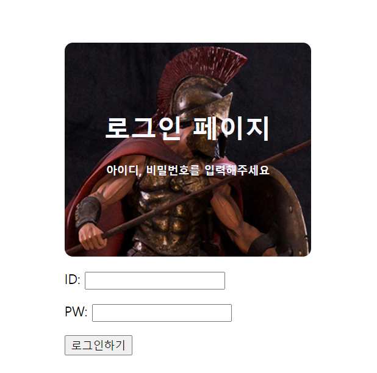
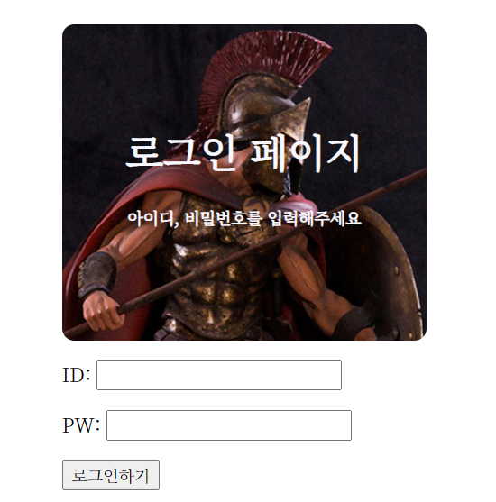
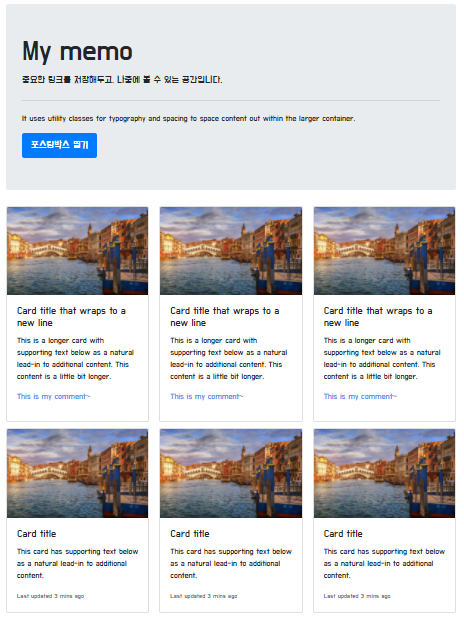
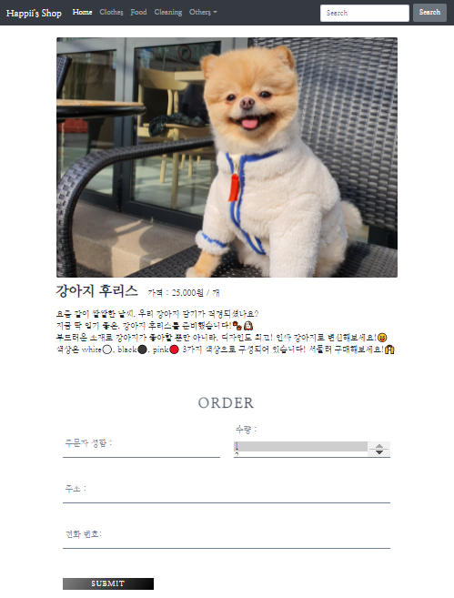
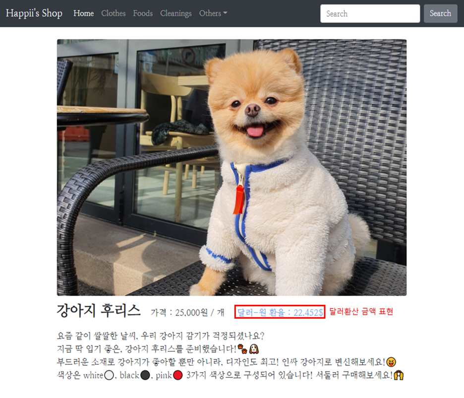
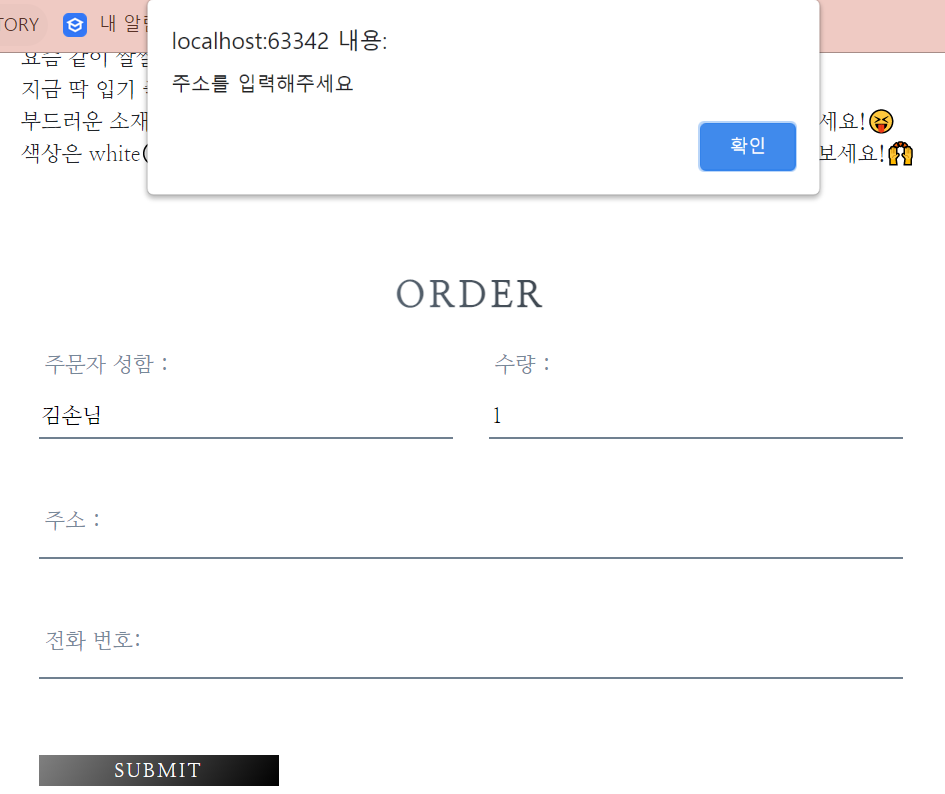

# 🎨 Web_Development 🎨
🖌 2021.04.17 - 2021.06.19<br>
🖌 청년공간 이룸 - SeriesD Developer 과정<br> 
🖌 각 Week 카테고리는 수업 및 과제로 구성되어 있으며, 과제는 📒 에서 확인할 수 있다.<br><br>

## 🖼 Week01

<details>
  <summary><b>1.1 HTML & CSS 기초</b></summary><br>
  HTML 기초 태그를 알아보고, 로그인 창을 구현해 보았다.<br><br>

1. 로그인<br>

    > <a href = "https://github.com/bbjoite09/SeriesD/blob/master/practice/week01/login.html">practice/week01/login.html</a>

    h1, h5, input, button 태그를 이용하여 로그인 페이지를 만든다.

    <code>조건. 로그인 안내 내용, ID, PW 입력 칸은 style 태그를 이용하여 가로, 세로 축 기준 중앙으로 배치한다.</code>

    실행 결과는 아래 그림과 같다.

    <p align = center><p>
    

2. 로그인(CSS 분리)<br>

    > <a href = "https://github.com/bbjoite09/SeriesD/blob/master/practice/week01/login_noCSS.html">practice/week01/login_noCSS.html</a>

    협업을 하는 경우 파일의 분리는 필연적이다.<br>
    style 태그 내부의 내용을 main.css 파일로 옮겨 html/CSS 파일을 분리하였다.

     <p align = center><p>

     추가로, 페이지를 구성하는 글자의 <a src="https://fonts.google.com/?subset=korean"> 폰트</a>도 변경하였다.
     해당 내용은 <a href="https://github.com/bbjoite09/SeriesD/practice/week01/login_noCSS.html">여기</a>에서 확인할 수 있다.<br>

</details>

<details>
  <summary><b>1.2 Bootstrap</b></summary><br>

  > <a href = "https://github.com/bbjoite09/SeriesD/blob/master/practice/week01/bootstrap.html">practice/week01/bootstrap.html</a>

  부트스트랩을 이용해 클론페이지를 만들어 보았다. 실습 결과는 아래와 같다.
  <p align = center><p><br><br>
</details>
<details>
<summary><b>📒 나만의 one-page 쇼핑몰_01</b></summary><br>
임의의 상품을 판매하는 페이지를 만들어 보았다. 버튼에 대한 반응은 따로 처리하지 않았다.<br>

><a href ="https://github.com/bbjoite09/SeriesD/blob/master/practice/week01/product.html">practice/week01/product.html</a>

><a href = "https://github.com/bbjoite09/SeriesD/blob/master/practice/css/style_shop.css">practice/css/style_shop.css</a>

해당 내용은 <a href ="https://github.com/bbjoite09/SeriesD/blob/master/practice/week01/product.html">여기</a>에서 확인할 수 있다.<br>

<p align = center><p>
<br>
</details>


## 🖼 Week02
<details>
  <summary><b>2.1 JavaScript & jQuery</b></summary><br>

  Week01에서 학습했던 HTML, CSS만으로는 정적인 화면 표현만 가능하였다. 이에 동적 움직임을 줄 수 있도록 하는 언어가 <code>Javascript</code>이다. Javascript는 객체 기반의 프로그래밍 언어이며, ECMAScript의 표준 사양을 가장 잘 구현한 언어로 대부분의 브라우저에서 이를 지원한다.(모든 웹 서버는 HTML, CSS, Javascript를 응답 데이터로 전송함.)<br><br>

  1. Javascript 기초 문법<br>
  
      > <a href = "https://github.com/bbjoite09/SeriesD/blob/master/practice/week02/main.js">practice/week02/main.js</a>
  
      > <a href = "https://github.com/bbjoite09/SeriesD/blob/master/practice/week02/main.test.js"> practice/week02/main.test.js</a>

      자바스크립트 기초 문법(변수정의, function, 조건문, 반복문 등)을 학습하였다. 추가로 test file을 만들어, 필요한 테스트를 실행해보았다. test 파일을 통해 main 코드에 대한 test를 진행함으로써 더 견고한 코드를 만들 수 있다.<br>
      +) 일반적으로 test 파일 이름은 <code> 테스트하는 파일.test.js</code> 형식으로 설정한다. 여기서는 main.js를 테스트하므로 main.test.js로 명명하였다.

  2. jQuery
      ><a href = "https://github.com/bbjoite09/SeriesD/blob/master/practice/week02/memo.html">practice/week02/memo.html</a>

      <code>jQuery</code>는 javascript 라이브러리로, HTML 속 클라이언트 사이드 스크립트 언어를 단순화하도록 설계되었다. 이는 매우 간단하다는 특징을 가지고 있으며 브라우저 호환성이 있다.<br>
      ```
      document.getElementById('post-url').value
      >> "Hello"

      $("post-url").val()
      >> "Hello"
      ```

      jQuery를 사용할때는 `<head>`태그 안에 아래 문장을 import 시켜줘야한다.<br>
      `<script src="https://ajax.googleapis.com/ajax/libs/jquery/3.5.1/jquery.min.js"></script>`<br>
      <br>
      week01에서 진행하였던 memo.html에 jQuery를 사용하여 "포스팅박스 열기" 버튼에 대한 반응을 추가했다. 해당 실습에 대한 내용은 <a href = "https://github.com/bbjoite09/SeriesD/blob/master/practice/week02/memo.html">여기</a>에서 확인할 수 있다.

</details>
<details>
  <summary><b>2.2 Ajax & jQuery</b></summary><br>
  
  `Ajax`는 Javascript의 라이브러리 중 하나로 비동기 서버 통신 및 클라이언트와 서버간에 XML 데이터를 주고받는 기술을 말한다. 이때 `비동기`이란 사용자가 보고있는 페이지에 대하여 어떤 동작이 일어났을때, 웹 페이지 전체를 갱신하지 않고 일부분만 업데이트 할 수 있도록하는 것을 말한다. 이는 전체 페이지를 계속해서 갱신하지 않는다는 점에서, 불필요한 낭비를 줄이고 웹페이지의 속도를 향상시킨다.<br><br>
  한편 `서버통신`은 서버의 자원을 제공받기 위해 서버-클라이언트 간에 request, response를 하는 것을 말한다.

  - Request<br>
    클라이언트는 서버에게 Request 한다. Request의 method로는 DELETE(지우기), GET(가져오기), POST(추가하기) 등이 있다.

  - Response<br>
    서버는 클라이언트에게 Response 한다. HTTP 통신 프로토콜에서는 Response status code로 응답의 상태를 표현하는데, 응답은 5가지 그룹으로 나뉜다. 대표적으로 정상 응답(200 OK), 클라이언트 에러(404 not found), 서버 에러(500 Internal Server Error)가 있다.

<br>
<실습><br>
  
1. 서울시 OpenAPI(<a href="http://openapi.seoul.go.kr:8088/6d4d776b466c656533356a4b4b5872/json/RealtimeCityAir/1/99">실시간 미세먼지 상태</a>)를 이용하여 미세먼지 수치(PM10)가 25㎍/㎥ 이상인 관측소(MSRSTE_NM)를 빨강색으로 표시해준다.

    > <a href="https://github.com/bbjoite09/SeriesD/blob/master/practice/week02/ajaxTest.html">practice/week02/ajaxTest.html</a>

2. 일반 API(<a href="https://api.thecatapi.com/v1/images/search">고양이 사진</a> API)를 활용하여 랜덤으로 고양이 이미지를 출력해준다.

    ><a href="https://github.com/bbjoite09/SeriesD/blob/master/practice/week02/randomCat.html">practice/week02/randomCat.html</a>

  <br>
</details>
<details open>
  <summary><b>📒 Javascript and jQuery Practice</b></summary><br>
  1. Javascript
  
  - 버튼을 누를때마다 누른 횟수에 대한 alert창을 띄운다.

    ><a href="https://github.com/bbjoite09/SeriesD/blob/master/practice/week02/homework/buttonCnt.html">practice/week02/homework/buttonCnt.html</a>

  - 버튼의 count를 세어, 짝/홀에 따라 다른 alert을 띄운다.(alert.html는 alert만, alert_up.html은 alert와 함께 button의 count를 화면에띄워준다.)

    ><a href="https://github.com/bbjoite09/SeriesD/blob/master/practice/week02/homework/alert.html">practice/week02/homework/alert.html</a>
  
    ><a href="https://github.com/bbjoite09/SeriesD/blob/master/practice/week02/homework/alert_up.html">practice/week02/homework/alert_up.html</a>
  - 서울시 Open API(<a href="http://openapi.seoul.go.kr:8088/6d4d776b466c656533356a4b4b5872/json/bikeList/1/99 ">실시간 따릉이 데이터</a>)를 활용하여, 사용자가 입력한 수 이하의 자전거를 보유한 정류장을 출력한다.(bike_up 에서는 0이하의 대수에 대해서는 검색이 불가하도록 처리하였다.)
    ><a href="https://github.com/bbjoite09/SeriesD/blob/master/practice/week02/homework/bike.html">practice/week02/homework/bike.html</a>

    ><a href="https://github.com/bbjoite09/SeriesD/blob/master/practice/week02/homework/bike_up.html">practice/week02/homework/bike_up.html</a>

<br>
2. jQuery<br>

- 입력값이 빈칸이면 경고메시지를, 아니면 입력값을 alert 한다.
  ><a href="https://github.com/bbjoite09/SeriesD/blob/master/practice/week02/homework/inputText.html">practice/week02/homework/inputText.html</a>
- 입력받은 이메일이 올바르지 않은 형식이면 경고메시지를, 아니면 도메인을 alert 한다.
  ><a href="https://github.com/bbjoite09/SeriesD/blob/master/practice/week02/homework/inputEmail.html">practice/week02/homework/inputEmail.html</a>

  <br><br>
</details>
<details open>
<summary><b>📒 나만의 one-page 쇼핑몰_02</b></summary><br>

week01의 과제 "나만의 one-page 쇼핑몰_01"에 Javascript와 Ajax를 사용하여 아래 조건을 추가한다.<br>

><a href="https://github.com/bbjoite09/SeriesD/blob/master/practice/week02/product.html">practice/week02/homework/product.html</a>

<code> 조건1. 사용자가 Order란에 주문자 성함, 수량, 주소, 전화번호를 기입하지 않았을 때 alert를 보낸다.<br>
  
  조건2. <a href="https://api.manana.kr/exchange/rate.json">환율정보 API</a>를 활용하여 원화 가격 우측에 달러 가격을 표시한다.</code>

실습결과는 아래와 같다.<br>
- 달러환산 금액 표현<br><br>
<p align=center></p>

- 사용자 주문 정보 미기입시 alert<br><br>
<p align=center></p>
</details>
<details open>
<summary><b>📒 Ajax Practice</b></summary><br>

- <a href="https://openlibrary.org/subjects/love.json?published_in=1900-2000"> 책 API</a>를 활용하여 사랑에 관한 책 리스트를 출력한다.

  > <a href="https://github.com/bbjoite09/SeriesD/blob/master/practice/week02/homework/loveBook.html">practice/week02/homework/loveBook.html</a>

- <a href="https://openlibrary.org/dev/docs/api/subjects "> 책 API</a>를 활용하여 컴퓨터 주제 책에 대한 내용을 출력한다.

  > <a href="https://github.com/bbjoite09/SeriesD/blob/master/practice/week02/homework/comBook.html">practice/week02/homework/comBook.html</a>

- <a href="http://numbersapi.com/"> 랜덤 숫자 의미부여 API</a>를 이용하여 입력한 숫자에 대한 의미를 출력한다.

  > <a href="https://github.com/bbjoite09/SeriesD/blob/master/practice/week02/homework/numMean.html">practice/week02/homework/numMean.html</a>
</details>

